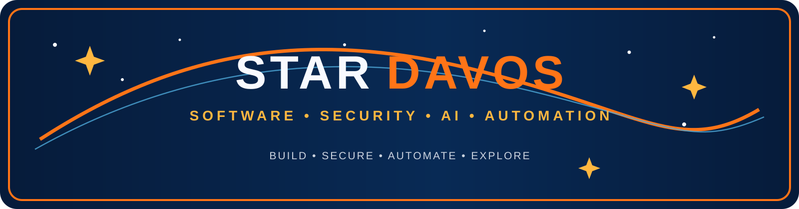

<p align="center">
  
</p>

<p align="center">
  
  
  
  
</p>

<table>
<tr>
<td width="58%" valign="top">

## ✦ Star Davos // Mission Profile

I build **secure systems**, automate repetitive work, and turn infrastructure problems into repeatable solutions.

My focus is practical, security-first engineering:

- secure automation
- AI-assisted tooling
- Microsoft / Azure / Intune administration
- infrastructure troubleshooting and operational improvement
- developer tools that reduce manual work without increasing risk

**Current objective:** build systems that make people faster while **reducing blast radius**, not expanding it.

</td>
<td width="42%" valign="top">

```text
> whoami

name:     Rocco Buttiglieri
brand:    Star Davos Software
role:     Support Engineer
focus:    Security • AI • Automation • Infrastructure
mission:  Build secure systems.
          Automate everything.
status:   Always building.
